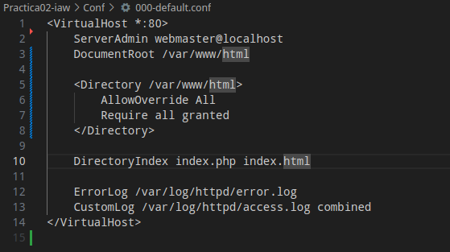

# Practica02-iaw
Repositorio para la practica 02 de IAW del curso 25/26

# Install_lamp.sh
## Instalamos Apache HTTP Server, MariaDB y PHP en un sistema Red Hat
### Actualizamos los repositorios
dnf update -y

### Instalamos Apache HTTP Server
dnf install -y httpd

### Iniciamos y habilitamos Apache
systemctl enable --now httpd

### Copiamos el archivo de configuración (ajustado para Red Hat)
cp ../Conf/000-default.conf /etc/httpd/conf.d/default.conf

### Instalamos MariaDB (MySQL compatible)
dnf install -y mariadb-server

### Iniciamos y habilitamos MariaDB
systemctl enable --now mariadb

### Instalamos PHP y extensión para MySQL
dnf install -y php php-mysqlnd

### Copiamos el archivo index.php de la práctica al directorio raíz de Apache
cp Practica02-iaw/php/index.php /var/www/html/index.php

### Reiniciamos Apache para aplicar cambios
systemctl restart httpd

## Demostracion de funcioanmiento de PHP

## Demostracion de funcioanmiento de Script Install_lamp.sh

# Install_tools.sh
## Instalamos Phpmyadmin en el sistema Red Hat
### Importamos el archivo .env
source .env

### Instalamos PHPmyAdmin
dnf update
dnf install php-mbstring php-zip php-json php-gd php-fpm php-xml -y

### Reiniciamos el servicio de Apache para que se apliquen los cambios.
systemctl restart httpd

### Accedemos al directorio /var/www/html.
cd /var/www/html

## Instalamos la utilidad wget para poder descargar el código fuente de phpMyAdmin.
dnf install wget -y

### Descargamos el código fuente de phpMyAdmin.
wget https://www.phpmyadmin.net/downloads/phpMyAdmin-latest-all-languages.tar.gz

### Descomprimimos el archivo que acabamos de descargar.
tar xvf phpMyAdmin-latest-all-languages.tar.gz

### Eliminamos el archivo .tar.gz.
rm phpMyAdmin-latest-all-languages.tar.gz

### Renombramos el directorio.
mv /var/www/html/phpMyAdmin-*-all-languages/ phpmyadmin

#--------------------------------------------------------------------------------------------------------------------------------------------------
### Creamos usuario y contraseña para la base de datos
mysql -u root -e "drop user if exists $DB_USER@'%'"
mysql -u root -e "Create user $DB_USER@'%' IDENTIFIED BY '$DB_PASSWORD'"

### Le damos privilegios al usuario
mysql -u root -e "Grant all privileges on $DB_NAME.* TO $DB_USER@'%'"
mysql -u root -e "FLUSH PRIVILEGES"

## Demostracion de funcioanmiento de PHPmyadmin

## Demostracion de funcioanmiento de Script Install_tools.sh
